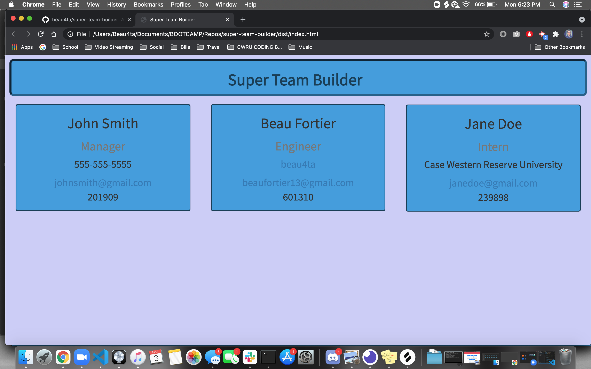

 # Super Team Builder
  
  ## Description
  This application prompts the user and generates an HTML page containing information based off of the team you build.

  ## Table of Contents
  - [Description](#description)
  - [Installation](#installation)
  - [Usage](#usage)
  - [License](#license)
  - [Contributing](#contributing)
  - [Tests](#tests)
  - [Questions](#questions)

  ## Installation
  npm install also install express

  ## Usage
  node index.js and respond to the prompts

  ## License
  N/A
  
  ## Contributing
  Beau Fortier

  ## Tests
  Yes. The test involved include testing the constructors

  ## Questions
  Send any questions to my email
  
  GitHub: [beau4ta](https://github.com/beau4ta)
  
  Email me with any questions: beaufortier13@gmail.com
  
  Link to video: https://drive.google.com/file/d/1djfYzzV0spWdEY8hqtrTxDd2VXb_MTCh/view

  
